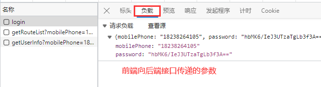

# 笔记

---

## 一、idea操作
> 1、在文件中按 `ctrl + f` 是打开搜索框，可搜索当前文件内容
> 
> 

> 2、按两下 `shift` 键，可打开全局搜索框，可以搜索整个项目的接口路径、文件名等等
> 
> > 

> 3、左上角`master`是在github上对应的分支名称，里面的：
> - `update project`可以同步我推上去的代码，一般你改代码之前都要update一下，防止代码没有及时同步的冲突；
> - 剩下的`commit`和`push`你懂的，完成一个功能后就提交以下；

---

## 二、代码
> 1、多看代码，看懂了就在每行代码上注释一下，防止遗忘

> 2、看代码重在看流程，不是单单看懂某一行，比如你要搞懂新增功能：
> - 无论是前后端分离还是不分离， 你首先要把项目运行起来，自己操作一遍新增；
> - 操作一遍以后，你就知道新增就是`点击一个新增按钮`，`跳转到新页面`，然后`输入一些数据`，`点确定`，`保存到数据库`的这么个过程；
> - 熟知过程以后，按照你操作的顺序一步一步来，第一部肯定是先点击新增按钮打开页面，`点击新增按钮的时候发生了什么`，要知道这个按钮发生了什么，肯定是在`html`找到新增按钮，看看这个按钮`触发了什么方法`，然后去看这个方法，
> - 找一找方法中跳转页面的操作，看看`跳转到哪一个html`文件了，
> - 然后去找到这个`新增页面的html`，然后这个页面肯定有一个`保存按钮`，再去看这个`保存按钮触发了什么方法`，有没有调用后端接口，
> - 有的话就`复制一下html写的后端接口地址`，`去idea后端代码里面搜索这个接口`对应的controller方法，看看这个方法做了什么东西，给前端返回了什么数据，
> - 前端拿到返回的数据以后，又做了些什么
> - 这样就把整个流程的代码顺序梳理了，不要在代码中乱找，这个文件看看那个文件看看，不知道程序运行到哪里了

---

## 三、修复报错的思路
> 1、功能没有达到预期效果，第一反应不要去看代码，第一反应应该是`打开浏览器的F12`，再操作一遍，看一看请求的`接口地址对不对`，`传递的参数有没有少和错`，`后端返回的结果是不是想要的`；
> 
> 
> 
> 

> 2、如果F12显示`接口直接报错`了，去`idea`看一下`控制台`打印的日志，认真读英文，是什么错误，是`哪个文件的哪一行`报错了，`都有打印出来`，然后去报错的地方看;
>
> 

> 3、如果报错的`日志没有打印`具体在哪一行，说明是刚进入接口就报错了，这种报错有`两种`情况，`一是`你前端的请求方式是get，而后端是用postMapping接收的，`二是`检查前端传递的参数是否符合后端要求，就像今天遇到的日期不符合接收的格式
>
> 

